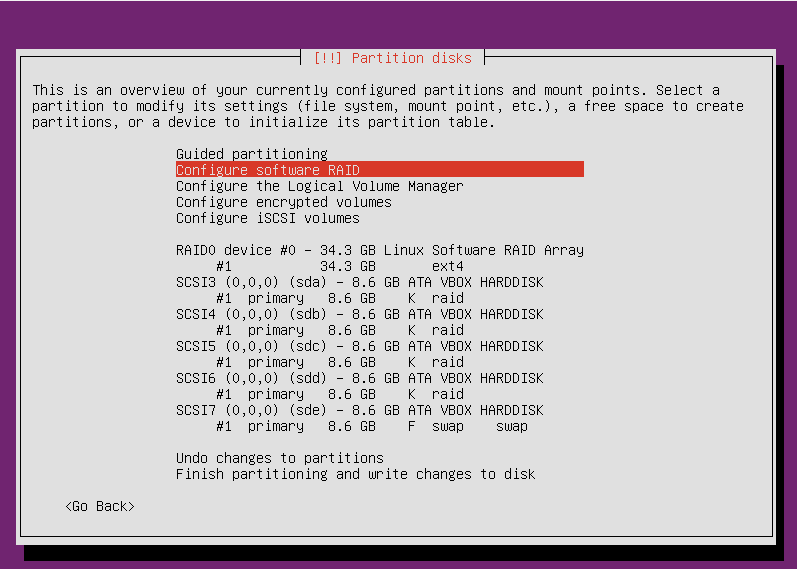

# Servidores_Linux
Antes de configurar el servidor debemos configurarlo con una ip fija
auto eth0
iface eth0 inet static
address 192.168.0.10
netmask 255.255.255.0
gateway 192.168.0.1
dns-nameservers 192.168.0.10 

La máquina con servidor DNS tendrá la siguiente configuración en la instalación del sistema operativo

Y las maquinas de servidor web y ftp:

Creamos un servidor DNS instalando el servicio con el comando: apt-get install bind9

Modificamos el archivo /etc/bind/named.conf.local para añadir las zonas directas e inversas de los servidores apache y ftp

En el archivo /etc/bind/named.conf.options debemos descomentar las lineas de los "forwarders"

Tras esto, debemos crear los archivos pertinentes para cada zona directa e inversa (segun la red en la que se encuentren)
Resolucion directa

Resolucion inversa

Para instalar los servicios de apache y ftp utilizaremos los siguientes comandos:
apt-get install apache2
apt-get install vsftpd
